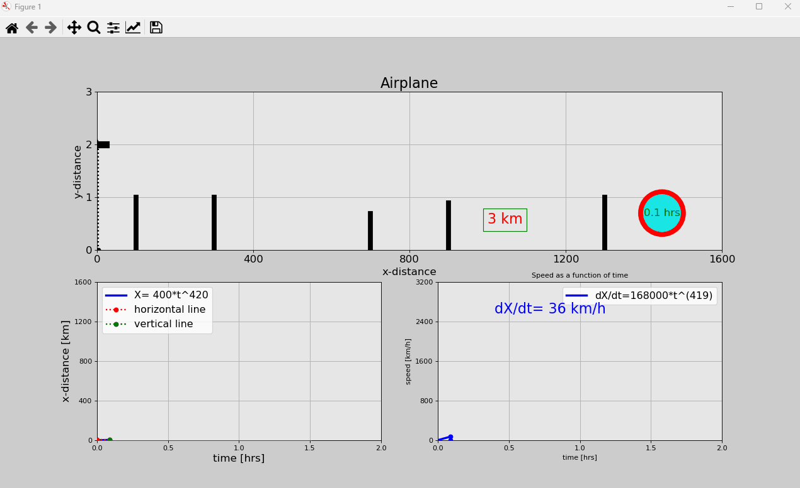

# Airplane – Simulação de Decolagem

Este projeto foi inspirado no curso em inglês **"Python Engineering Animations: Bring Math & Data to Life"** da Udemy.  
Ele demonstra como criar animações científicas utilizando Python, simulando o movimento de um avião durante a decolagem.

---

## 🎥 Demonstração

  

---

## 🚀 Tecnologias Utilizadas
- **Python 3.x**
- **Matplotlib** – Para gráficos e animação
- **NumPy** – Para cálculos matemáticos
- **FuncAnimation** – Para controlar os quadros da animação

---

---

## 🔧 Instalação e execução
Clone o repositório e instale as dependências:
```bash
git clone https://github.com/JsnEvt/airplane.git
cd airplane
pip install -r requirements.txt
python airplane.py

```

## Licença
Este projeto é apenas para fins educacionais e está sob a licença MIT.
